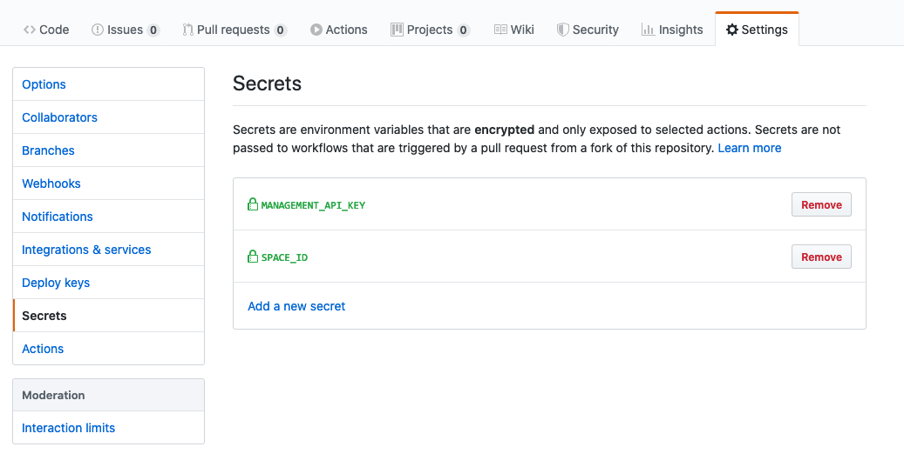

Contentful Action Example
=====

An example application for how you can integrating content migrations in your continuous delivery pipeline using the Contentful GitHub Actions.

What is this about?
=====

This example contains a folder of Migration Scripts. Whenever a new script is added to this repo, it's evaluated against a Contentful space. If the migration is added via pull request, a new enviroment is created on Contentful and the migration is run against that. If a new script is added to master (either directly or via merging a PR) then a new enviroment is created, migrations are run against that enviroment and then the alias for master is updated to point to that new enviroment.

You can read our [conceptual guide](https://www.contentful.com/developers/docs/concepts/deployment-pipeline/) on how to utilize Contentful Environments inside your continuous delivery pipeline.

You can futher expand this example by integrating other GitHub actions, such as testing and deployment options.

Getting started
=====

### Requirements

To use the continuous delivery pipeline of this project you need accounts for the following services:

- [Contentful](https://www.contentful.com)
- GitHub

### Setup

* Fork and clone this repository

#### The Contentful part (required)

* Create a new space using the Contentful CLI
  * `$ contentful space create --name "continuous delivery example"`
* Set the newly created space as default space for all further CLI operations
  * `$ contentful space use` (this will present you with a list of all available spaces – choose the one you just created)
* Import the provided content model (`./import/export.json`) into the newly created space
  * `$ contentful space import --content-file ./import/export.json`

#### The continuous delivery pipeline

Since we're using GitHub Actions, we'll be able to use the existing [Contentful-Action]() repo. Just add the following code into your github workflow.

```yml
    - name: Contentful Migration
      id: migrate
      uses: shy/contentful-action@master
      env: # Set the secret as an input
        SPACE_ID: ${{ secrets.SPACE_ID }}
        MANAGEMENT_API_KEY: ${{ secrets.MANAGEMENT_API_KEY }}
```
You can view the [main.yml](.github/workflows/main.yml) for example of a full working confirguration.



You'll also need to add your `SPACE_ID` and `MANAGEMENT_API_KEY` in the secrets tab of the settings on your repository.

License
=======

Copyright (c) 2019 Contentful GmbH. Code released under the MIT license. See [LICENSE](LICENSE) for further details.
